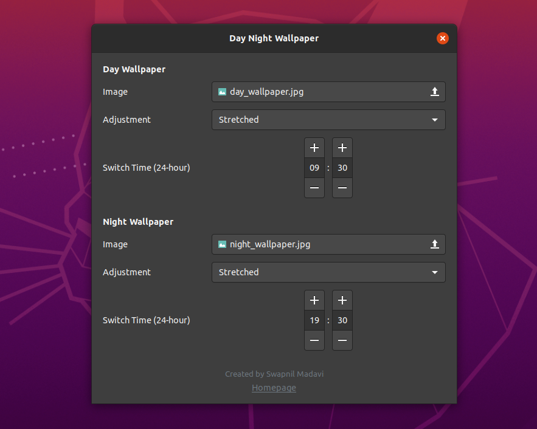

# day-night-wallpaper-gnome-extension
A simple GNOME extension to set separate wallpapers for day and night time.

<p align="center">
  
</p>

This extension supports GNOME shell versions 3.28 - 3.36.  
Please check the branch `gnome-shell-3-28-3-30` for shell versions 3.28 - 3.30.

## Installation

<a href="https://extensions.gnome.org/extension/3512/day-night-wallpaper/">
</a>

### Manual

```
cd ~/.local/share/gnome-shell/extensions/
git clone https://github.com/swapnilmadavi/day-night-wallpaper-gnome-extension.git day-night-wallpaper@swapnilmadavi.github.io
```
Restart the gnome-shell by pressing `Alt+F2`, then type `r` and press the `Enter` key.  
Now you can enable the extension from either Extensions or Tweaks application.